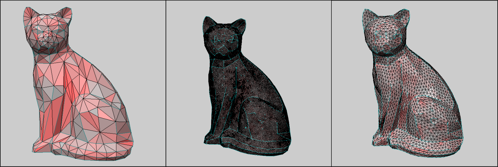

**Links:**

- [Source Code (GitHub)](https://github.com/chipnbits/minimesh_isotropic_remesher)
- [Report (PDF)](main_report.pdf)

## Abstract

This project presents an implementation of uniform explicit isotropic remeshing, designed to regularize 3D triangle meshes while preserving geometric features and boundary integrity. The algorithm follows the classic pipeline proposed by Botsch and Kobbelt (2004), synthesized with modern implementation details from the 2015 Master's thesis by Tanja. The system robustly handles edge splitting, collapsing, flipping, and tangential smoothing. Particular attention is given to the preservation of sharp creases and open boundaries, ensuring that the remeshing process does not degrade the topological genus or the visual fidelity of the input model.

