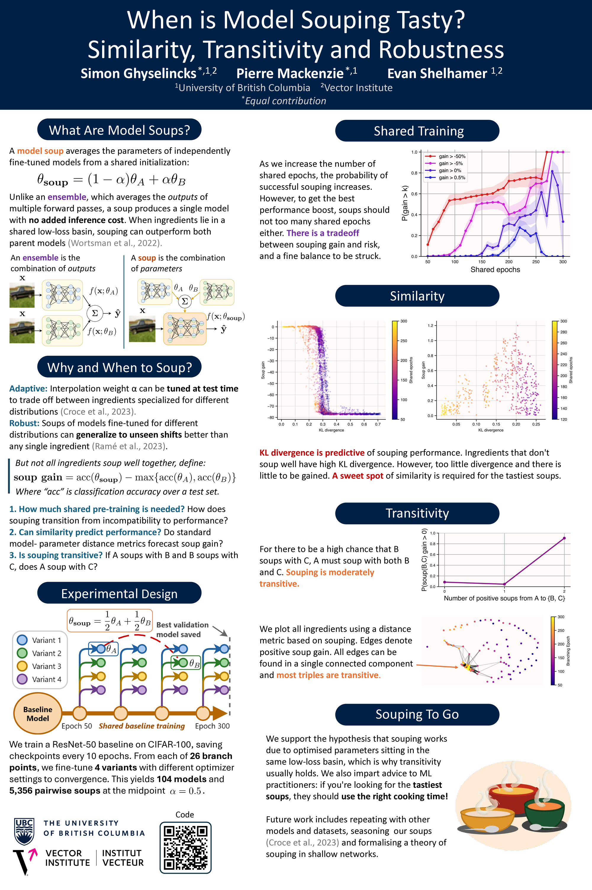

*Authors: Simon Ghyselincks\*, Pierre Mackenzie\*, Evan Shelhamer. \*Equal contribution. University of British Columbia and Vector Institute.*

**Links:**

- [OpenReview (ICLR 2026 TTU Workshop)](https://openreview.net/forum?id=59weCTbw1Q)
- [Poster (PDF)](poster.pdf)
- [Code (GitHub)](https://github.com/chipnbits/too-salty)

Accepted to the [ICLR 2026 Test-Time Updates (TTU) Workshop](https://ttu-iclr2026.github.io/) and presented as a poster on April 27, 2026 in Brazil.

## Abstract

Model souping is a post-training technique where the parameters of models are averaged, often leading to improved performance over constituent models without increasing inference cost. However, the specific conditions required for success are not well understood, particularly regarding the trade-off between model diversity and stability. We analyse over 5,000 two-model ResNet-50 soups trained on CIFAR-100, with diversity controlled by branching ingredients from a shared training trajectory at varying epochs. We find that effective souping requires a balance: models must be similar enough to avoid model collapse, but diverse enough to yield improvements. We show that we can predict soupability relatively well with standard similarity metrics. Furthermore, we provide empirical evidence for the hypothesis that souping works by averaging within a low-loss basin by showing that souping is moderately transitive. We also observe that soup gains on corrupted data are strongly correlated with those on in-distribution data. Our findings yield practical advice for machine learning practitioners: if you want a tasty soup, use the right cooking time!

## Poster

