## Workshop

**Optimization, AI, and Inverse Problems Workshop**
Hosted by Dr. Ahmet Alacaoglu at UBC.

This workshop brought together researchers and practitioners interested in optimization and its applications in AI and inverse problems, exploring the fundamentals of optimization algorithms and their applications in training AI models, as well as solving problems in key scientific applications such as geophysics, medical imaging, and physics.

Key themes included:

- Adaptive optimization algorithms
- Structured optimization
- Applications of optimization algorithms in scientific applications
- High-dimensional problems, large datasets, limited computational resources, and application-specific constraints

## Slides

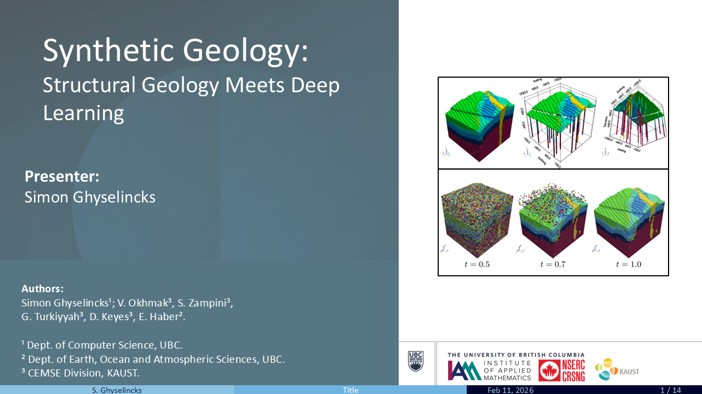

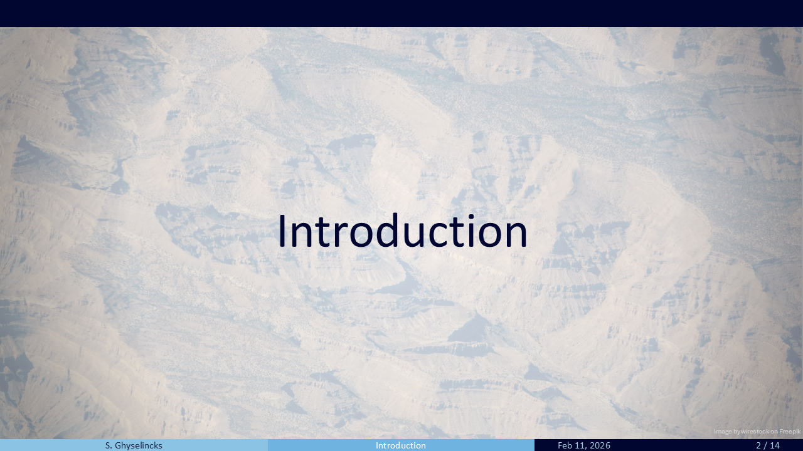

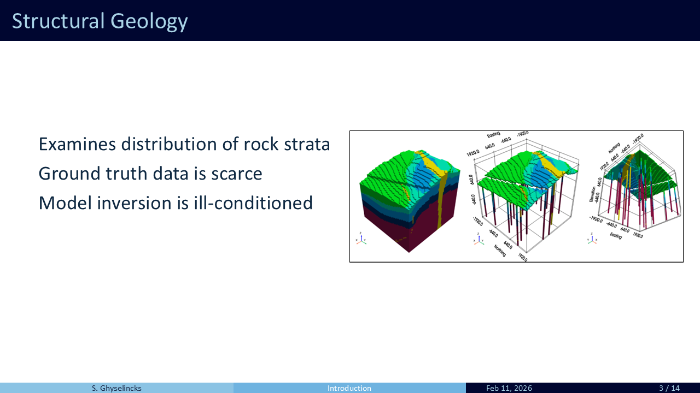

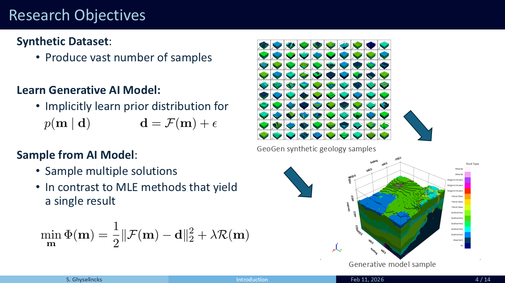

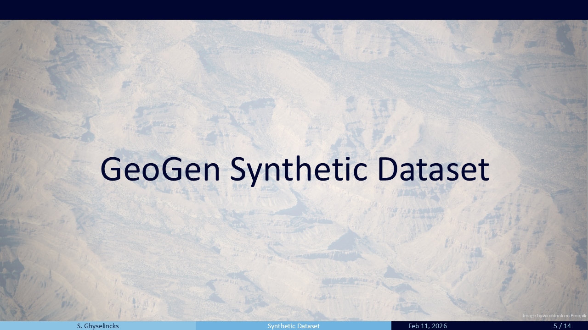

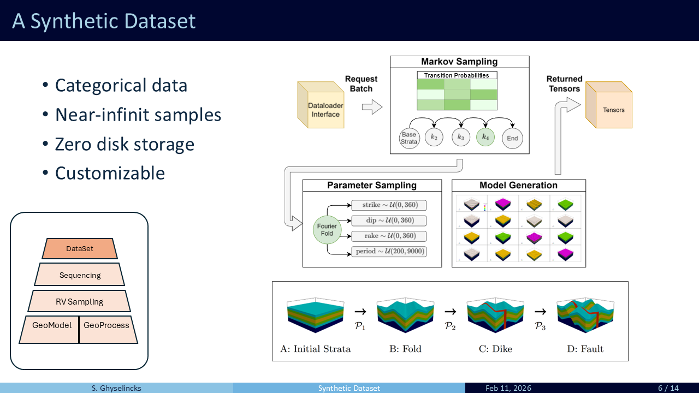

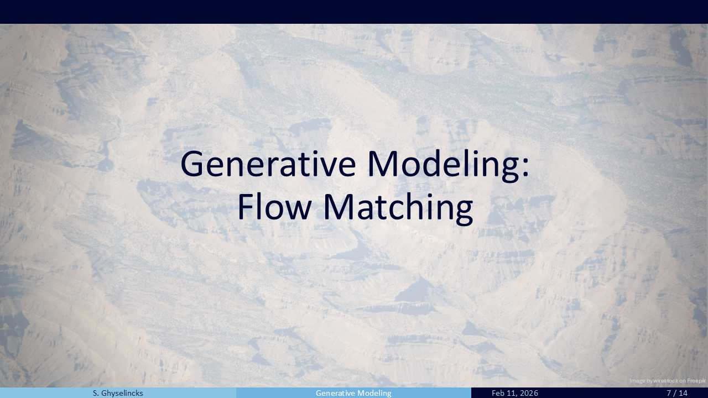

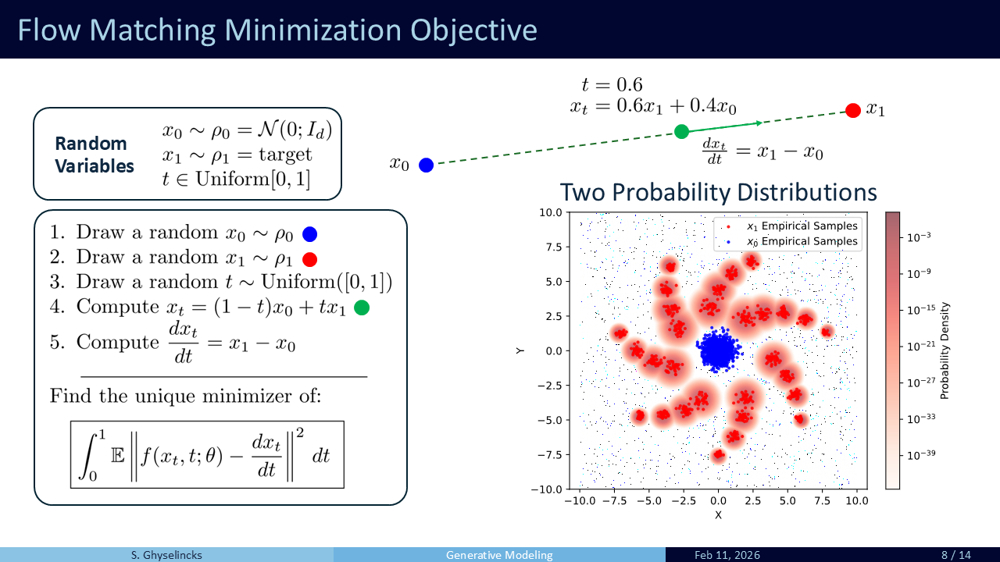

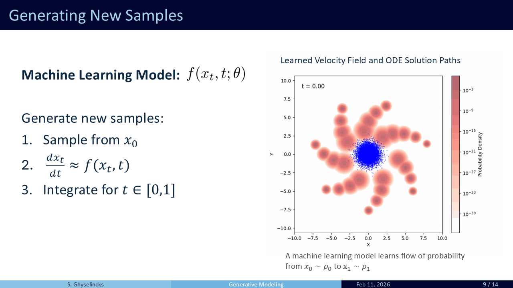

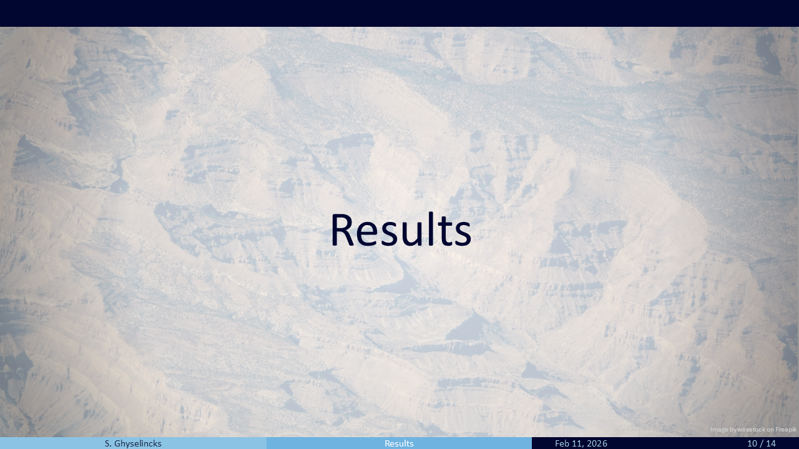

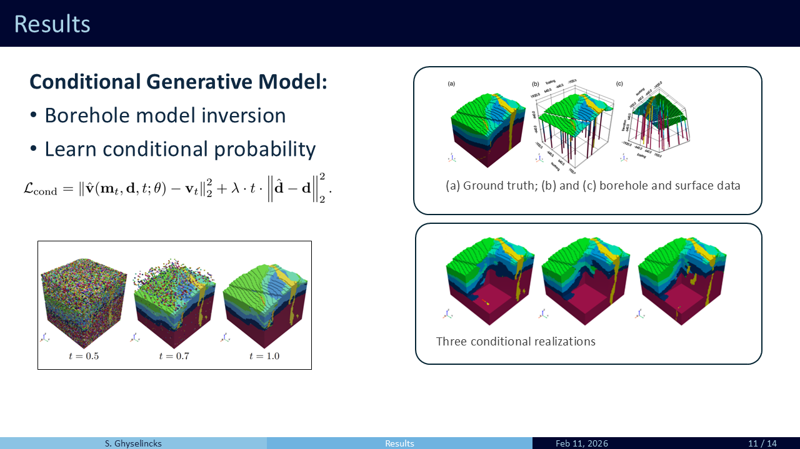

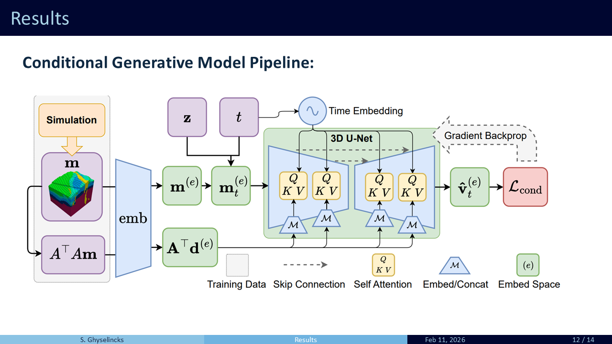

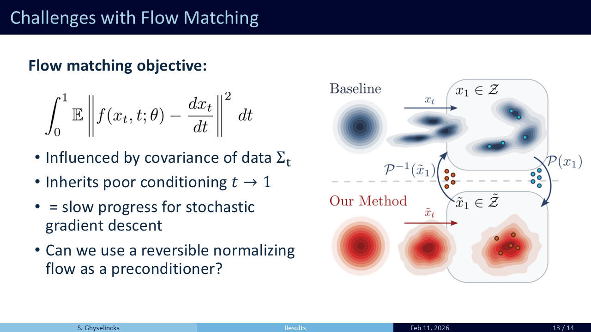

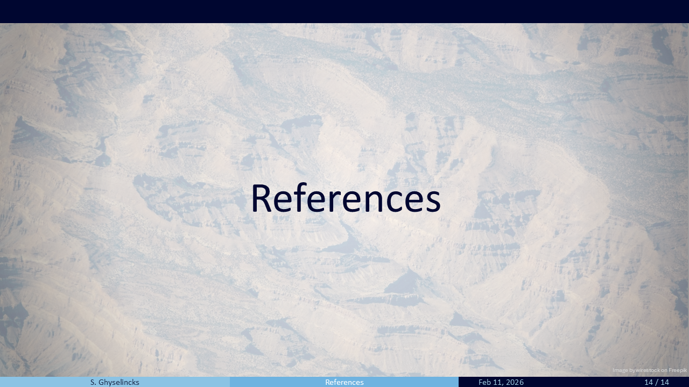

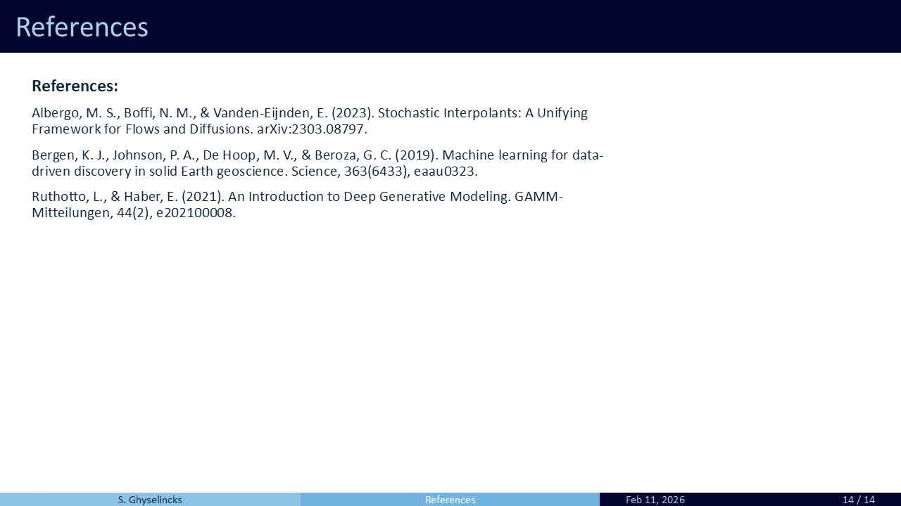
